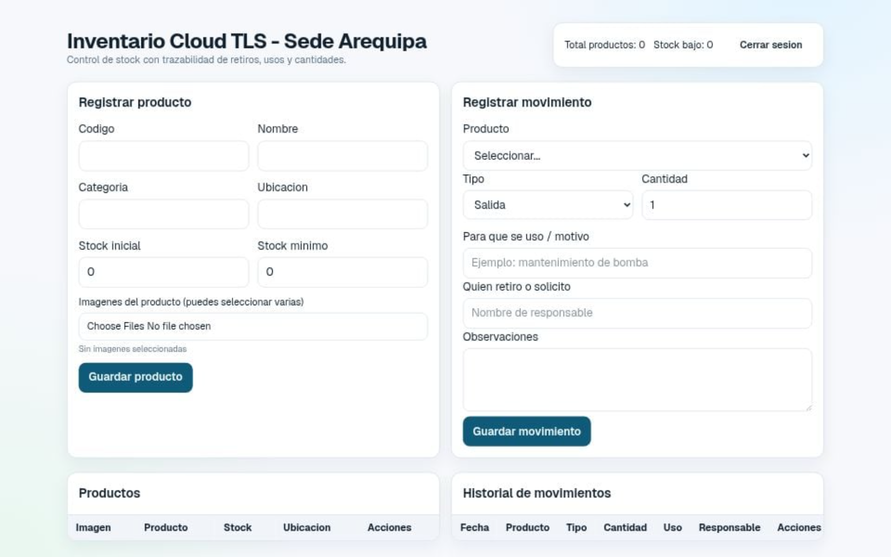

# Inventario Cloud (MVP)
Aplicativo web para control de inventarios con:



- Productos con imagen.
- Entradas y salidas de stock.
- Campo de trazabilidad: para que se uso, cantidad y quien retiro.
- Historial de movimientos.
- Funcion para borrar movimientos antiguos segun regla configurable.

## 1. Requisitos
- Node.js 20 LTS (recomendado para evitar incompatibilidades).
- Cuenta en Supabase.
- Cuenta en Vercel (opcional para despliegue).

## 2. Crear proyecto Supabase
1. Crea un proyecto nuevo.
2. Ve a `SQL Editor`.
3. Ejecuta completo el archivo [`supabase/schema.sql`](./supabase/schema.sql).
4. Ve a `Storage` y crea bucket llamado `products`.
5. Marca el bucket como `Public` para mostrar imagenes directamente.

## 3. Variables de entorno
1. Copia `.env.example` a `.env.local`.
2. Completa:
   - `NEXT_PUBLIC_SUPABASE_URL`
   - `NEXT_PUBLIC_SUPABASE_ANON_KEY`
   - `SUPABASE_SERVICE_ROLE_KEY`

## 4. Ejecutar local
```bash
npm install
npm run dev
```

Abrir `http://localhost:3000`.

## 5. Flujo funcional
1. Registrar producto (con stock inicial y foto opcional).
2. Registrar movimiento:
   - `Entrada` suma stock.
   - `Salida` resta stock y valida que no quede negativo.
3. Ver historial con fecha, producto, tipo, cantidad, uso y responsable.

## 6. Borrado de datos "segun lo que quieras"
Ya existe una funcion en SQL:

```sql
select public.cleanup_old_movements(365);
```

- `365` = conservar 365 dias, borrar lo mas antiguo.
- Puedes programarla en Supabase con `pg_cron` o ejecutarla manualmente.
- Si prefieres no borrar, simplemente no llames esa funcion.

## 7. Despliegue en Vercel
1. Subir proyecto a GitHub.
2. Importar repo en Vercel.
3. Configurar variables de entorno iguales a `.env.local`.
4. Deploy.

## 8. Pendientes recomendados para produccion
- Login de usuarios y roles (`admin`, `almacen`, `consulta`).
- Auditoria por usuario autenticado (`created_by` real).
- Exportar movimientos a CSV.
- Alertas por stock minimo (correo o WhatsApp).
